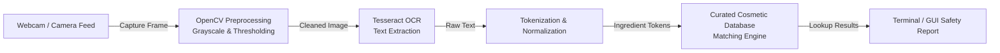

```markdown
# 🌿 LabelWise

[](https://www.python.org/)
[](https://opencv.org/)
[](https://github.com/tesseract-ocr/tesseract)
[](https://opensource.org/licenses/MIT)

> A Python-based computer vision application that captures skincare product packaging, extracts ingredient lists via OCR, and cross-references them against a curated safety database.

---

## 📌 Overview

Skincare ingredient lists are often printed in small, condensed fonts with complex chemical names (INCI), making it difficult for consumers to quickly spot harmful ingredients, allergens, or comedogenic compounds. 

**LabelWise** solves this locally on your machine:
1. Opens your camera feed to capture a product's ingredient panel.
2. Applies computer vision preprocessing (grayscale, thresholding, noise removal) to optimize text readability.
3. Uses **Tesseract OCR** to extract raw text strings.
4. Matches parsed ingredients against a curated safety dictionary and prints an instant safety assessment.

---

## 🎯 Features

* 📷 **Live Camera Capture:** Trigger packaging captures directly from your webcam feed using OpenCV.
* 🔍 **Image Preprocessing & OCR:** Cleans curved or poorly lit packaging text to improve Tesseract extraction accuracy.
* 🧪 **Ingredient Safety Lookup:** Splits comma-separated chemical names and matches them against a local safety dataset.
* ⚠️ **Risk Categorization:** Detects and flags:
  * Known irritants & common contact allergens
  * Comedogenic / pore-clogging ingredients
  * Harsh sulfates and drying additives

---

## 🏗️ How It Works



---

## 🛠️ Tech Stack & Requirements

* **Language:** Python 3.9+
* **Computer Vision:** `opencv-python`
* **Optical Character Recognition:** `pytesseract` & Google's Tesseract-OCR engine
* **Database:** Local structured dictionary / JSON / CSV containing cosmetic ingredients, hazard ratings, and descriptions

---

## 🚀 Getting Started

### 1. Prerequisites

You must have **Tesseract OCR** installed on your system in addition to Python.

#### **Windows:**

1. Download the Windows installer from [UB-Mannheim/tesseract](https://www.google.com/search?q=https://github.com/UB-Mannheim/tesseract/wiki).
2. Install it (default path is usually `C:\Program Files\Tesseract-OCR\tesseract.exe`).
3. If not added automatically to your system PATH, define the path in your Python code:
```python
import pytesseract
pytesseract.pytesseract.tesseract_cmd = r'C:\Program Files\Tesseract-OCR\tesseract.exe'

```


#### **macOS:**

```bash
brew install tesseract

```

#### **Linux (Ubuntu/Debian):**

```bash
sudo apt-get update
sudo apt-get install tesseract-ocr

```

---

### 2. Installation & Setup

```bash
# Clone the repository
git clone [https://github.com/vanechas/LabelWise.git](https://github.com/vanechas/LabelWise.git)
cd LabelWise

# Create and activate a virtual environment
python -m venv venv

# Windows:
venv\Scripts\activate
# macOS/Linux:
source venv/bin/activate

# Install required Python libraries
pip install -r requirements.txt

```

*(If you don't have a `requirements.txt` yet, install the essentials: `pip install opencv-python pytesseract`)*

---

### 3. Usage

Run the main application script:

```bash
python main.py

```

* Press **Spacebar** / **C** in the camera window to capture the label.
* The script will process the image, parse the text, and output the ingredient safety breakdown in your terminal.
* Press **ESC** / **Q** to exit.

---

## 📂 Project Structure

```text
LabelWise/
├── data/
│   └── ingredients.json       # Curated ingredient safety database
├── src/
│   ├── camera.py              # Video stream capture & hotkey controls
│   ├── preprocessor.py        # OpenCV image enhancement (contrast, binarization)
│   ├── ocr.py                 # Tesseract OCR wrapper & string parsing
│   └── analyzer.py            # Ingredient matching & safety logic
├── samples/                   # Sample product label images for testing
├── main.py                    # Application entry point
├── requirements.txt           # Python dependencies
└── README.md

```

---

## 📊 Database Structure

Ingredients are indexed locally using a simple schema:

```json
{
  "salicylic acid": {
    "safety_rating": "Safe / Beneficial",
    "function": "BHA Exfoliant, Acne Treatment",
    "caution": "Can cause dryness if overused."
  },
  "fragrance / parfum": {
    "safety_rating": "Caution",
    "function": "Masking Agent",
    "caution": "High potential for allergic contact dermatitis."
  }
}

```

---

## 🔮 Roadmap / Future Improvements

* [ ] Add fuzzy string matching (`thefuzz`) to handle minor OCR misspellings on curved bottles.
* [ ] Expand the curated ingredient dictionary with comedogenic ratings (0–5 scale).
* [ ] Build a lightweight local desktop GUI (Tkinter / CustomTkinter or PyQt).
* [ ] Build an automation database updater on the ingredients.

---

## ⚠️ Disclaimer

LabelWise provides cosmetic ingredient references based on publicly available cosmetic safety literature for educational and informational purposes only. It is not intended to replace personalized medical or dermatological advice.


```

```
